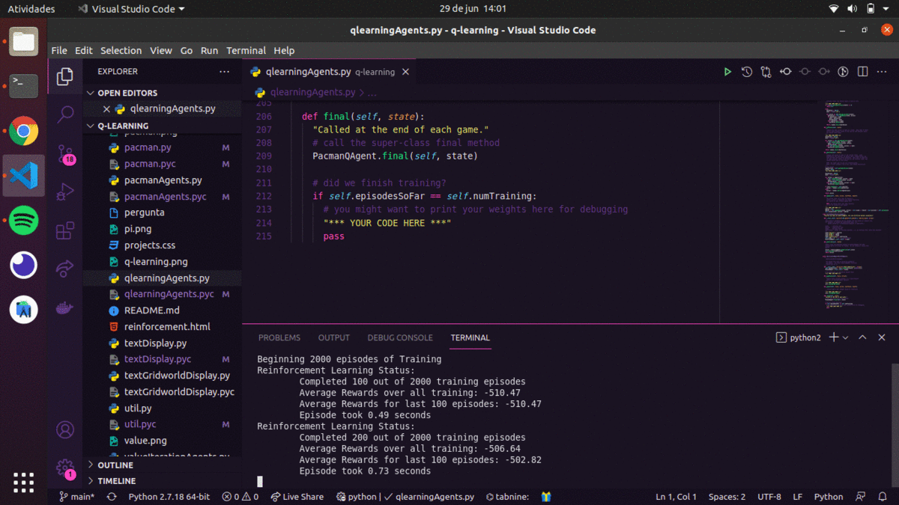

# :video_game: q-learning v1.0

<p align="center">
  
  
  
  
  
</p>

Código desenvolvido na UC Berkeley, por John DeNero (denero@cs.berkeley.edu) e Dan Klein (klein@cs.berkeley.edu).

Implementação do Q-learning:

qlearningAgents.py Agentes que executam o algoritmo Q-learning para o Gridworld, Crawler e Pac-Man

## :computer: Tecnologias

Este projeto foi desenvolvido com as seguintes tecnologias:

-  [Python](https://www.python.org/downloads/)
-  [Pip](https://pypi.org/project/pip/)
-  [VS Code](https://code.visualstudio.com/)

### :arrow_forward: Em Execução:

<p align="center">
 
</p>

### :information_source: Como usar:

Para clonar e executar esta aplicação, você precisará do Git instalado em seu computador. Na linha de comando:

```bash
# Clonar este repositório
$ git clone https://github.com/DiegoTeixeira7/q-learning.git

# Vá para o repositório
$ cd q-learning

# Instale as dependências (python 2)
$ sudo apt-get update && apt-get upgrade
$ sudo apt install python
$ sudo apt install python-pip

# Verificar se tudo foi instalado corretamente 
$ pip --version
$ python -V | python2 -V

# Execute o projeto
$ python pacman.py -p PacmanQAgent -x 2000 -n 2010 -l smallGrid | python2 pacman.py -p PacmanQAgent -x 2000 -n 2010 -l smallGrid

```
### :memo: Licença
Este projeto está sob a licença do MIT. Consulte a [LICENSE](LICENSE) para obter mais informações.
